# apps/image-builder/

Tekton-based image build pipeline for the platform. Clones a source repo,
scans for leaked credentials (gitleaks), builds the image with Buildah,
pushes to the Zot OCI registry, and emits a JSON summary. Triggered
automatically by Git webhooks (GitHub, Bitbucket, Azure DevOps) or manually
via `tkn` / `curl` / `kubectl apply`.

## Table of contents

1. [Architecture](#architecture)
2. [Prerequisites](#prerequisites)
3. [Webhook setup per Git provider](#webhook-setup-per-git-provider)
   - [Azure DevOps](#azure-devops)
   - [GitHub](#github)
   - [Bitbucket](#bitbucket)
4. [Triggering a build manually](#triggering-a-build-manually)
   - [Via `tkn`](#via-tkn)
   - [Via `kubectl apply`](#via-kubectl-apply)
   - [Via `curl` against the EventListener](#via-curl-against-the-eventlistener)
5. [Pipeline output](#pipeline-output)
6. [Consuming the built image](#consuming-the-built-image)
7. [Security hardening](#security-hardening)
8. [MicroK8s gotchas](#microk8s-gotchas)
9. [Troubleshooting](#troubleshooting)

---

## Architecture

The platform owns webhook routing + a shared Task library. The Pipeline
that wires those Tasks together lives in each **app's** source repo at
`deploy/pipelines/<image-name>.yaml` and is applied to this namespace by
the app's own ArgoCD Application. The EventListener resolves the Pipeline
by name (== image-name).

```mermaid
flowchart LR
    Webhook["Git push<br/>(GitHub / Bitbucket / Azure DevOps)"] --> EL[EventListener<br/>build.&lt;env&gt;.&lt;domain&gt;]
    EL -->|/github| TG[Trigger: github]
    EL -->|/bitbucket| TB[Trigger: bitbucket]
    EL -->|/azuredevops| TA[Trigger: azuredevops]
    TG --> TT[TriggerTemplate<br/>image-build]
    TB --> TT
    TA --> TT
    TT -->|spawn PipelineRun<br/>pipelineRef.name=image-name| PR[App-owned Pipeline<br/>e.g. fleet-backend]

    PR --> Clone["clone<br/><i>cluster-resolver →<br/>image-builder/git-clone</i>"]
    Clone --> Tag["tag<br/><i>generate-image-tag</i>"]
    Clone --> Gitleaks["gitleaks<br/><i>credential-scan</i>"]
    Tag --> Build["build<br/><i>buildah-build-push</i>"]
    Gitleaks --> Build
    Build --> Bump["bump<br/><i>yq-git-bump<br/>commits new tag<br/>to app's values.yaml</i>"]

    Build -->|push image| Registry[(Zot OCI registry<br/>zot.dev.&lt;domain&gt;)]
    Bump -->|git push| AppRepo[(app source repo<br/>deploy/chart/values.yaml)]
    AppRepo --> ArgoCD[ArgoCD reconciles<br/>→ rolling update]
```



Task library shipped by this app (referenced by app pipelines via
`resolver: cluster, namespace: image-builder`): `git-clone`,
`credential-scan`, `buildah-build-push`. That's it — by design.

Everything app-specific (version computation, tag format, write-back
target file, commit message convention) lives INLINE in each app's
own Pipeline via `taskSpec`. Apps that want semver from package.json
write that inline; apps that want calver or git-describe write that.
The image-builder is an image builder, not a version manager.

**Anti-loop**: the trigger CEL filter on each provider rejects pushes
where every commit is from `image-builder@platform` (the author bot used
by app pipelines' write-back step). Without this, every bump commit
would re-trigger a build. Pushes containing at least one human commit
still build.

Public entry point (Phase A — DEV cluster only):

| URL | Maps to | Auth model |
|---|---|---|
| `https://build.dev.<your-domain>/github` | `el-image-builder:8080` | HMAC-SHA256 in `X-Hub-Signature-256` |
| `https://build.dev.<your-domain>/bitbucket` | `el-image-builder:8080` | HMAC-SHA256 in `X-Hub-Signature` |
| `https://build.dev.<your-domain>/azuredevops` | `el-image-builder:8080` | Basic auth password (Phase A: header presence only — see [Security hardening](#security-hardening)) |

---

## Prerequisites

1. **Tekton installed** — see [`apps/tekton/README.md`](../tekton/README.md) for
   the upstream-YAML vendoring path. ArgoCD deploys `apps/tekton/` at sync-wave
   3 before this app (wave 25).

2. **MicroK8s registry add-on enabled** on the DEV node:
   ```bash
   microk8s enable registry
   ```

3. **Vault contents** at `dev/app/image-builder` (provision via the
   `setup-kubernetes/configs/secrets.<env>` schema + `--seed-vault`):
   - `gitcredentials` — multi-line **git credential-store file**, one
     `https://<user>:<pat>@<host>` record per Git provider the platform
     builds from. The Tekton git-clone Task envFroms this Secret and points
     git at it via `credential.helper=store`. Username conventions:
       - Azure DevOps:  `pat`           (anything works, AzDO ignores it)
       - GitHub:        `oauth2`        (recommended for fine-grained PATs)
       - Bitbucket:     `x-token-auth`  (App Password as the token)
     Generate PATs in each provider's developer-tokens UI with read-only
     repo scope. Rotate by editing this single Vault key + re-running
     `--seed-vault`.
   - `github-webhook-secret` — HMAC secret you'll paste into GitHub's
     webhook UI
   - `bitbucket-webhook-secret` — HMAC secret for Bitbucket
   - `azuredevops-webhook-secret` — Basic-auth password for Azure DevOps
     Service Hooks

   Generate webhook secrets with `openssl rand -hex 32` — they're shared
   between the Git provider and our cluster, so they don't need to be
   human-typeable.

4. **Vault role** (in sibling `setup-gitops` repo): add `image-builder` to the
   `external-secrets` role's `bound_service_account_namespaces` list.

5. **DNS** — `build.dev.<your-domain>` must point at the DEV cluster's
   ingress IP (same A record pattern as `gate.dev.<your-domain>` /
   `grafana.dev.<your-domain>`).

---

## Webhook setup per Git provider

All three providers follow the same pattern: configure a per-push webhook
pointing at the right path off our `build.<env>.<domain>` Ingress, with the
shared secret that's also in Vault. After config, push a commit and watch:

```bash
kubectl -n image-builder logs deploy/el-image-builder -f
```

### Azure DevOps

Azure DevOps uses **Service Hooks** at the **project** level (not repo-level).

#### Steps

1. Open the Azure DevOps project that holds your source repo.
2. Bottom-left: **Project settings** → **Service hooks**.
3. Click **`+ Create subscription`**.
4. **Service** section — pick **`Web Hooks`** from the list, click Next.
5. **Trigger** section:
   - Trigger on this type of event: **`Code pushed`**
   - Filters:
     - **Repository**: select the repo
     - **Branch**: `+ refs/heads/main` (Azure DevOps pre-filters here; our CEL
       filter also enforces `main|master` by default — see
       `eventListener.triggers.azuredevops.branchFilter`)
     - Pushed by a member of group: leave blank
   - Click Next.
6. **Action** section:

   | Field | Value |
   |---|---|
   | URL | `https://build.dev.<your-domain>/azuredevops` |
   | HTTP headers | _leave blank_ |
   | Basic authentication username | `tekton` *(any non-empty value; we don't validate username)* |
   | Basic authentication password | the value of `azuredevops-webhook-secret` from Vault |
   | Resource details to send | **All** |
   | Messages to send | **None** |
   | Detailed messages to send | **None** |

7. Click **Test**. Azure sends a synthetic Code-Pushed payload; you should
   see HTTP 200 / 202. If it fails, check the listener logs (`kubectl logs`)
   and the Azure DevOps event detail panel.
8. Click **Finish**.

#### What our side does with the request

1. Ingress routes `POST /azuredevops` to `el-image-builder:8080`.
2. CEL Interceptor in [`templates/triggers/azuredevops.yaml`](templates/triggers/azuredevops.yaml)
   checks:
   - `Authorization` header is present
   - `body.eventType == 'git.push'`
   - First `refUpdates[].name` starts with `refs/heads/` and the branch
     matches the configured regex.
3. TriggerBinding [`azuredevops-binding`](templates/triggerbindings.yaml)
   extracts:

   | Pipeline param | From payload |
   |---|---|
   | `git-url` | `body.resource.repository.remoteUrl` *(HTTPS clone URL)* |
   | `git-revision` | `body.resource.refUpdates[0].newObjectId` |
   | `image-name` | `body.resource.repository.name` |
   | `image-version` | `"0.0.0"` *(default)* |

4. TriggerTemplate `image-build` spawns the PipelineRun.

#### Test from the command line (Azure DevOps shape)

Useful for end-to-end checking without committing to the source repo. The
sample payload below matches Azure DevOps's Code-Pushed event shape:

```bash
# Use the same password you entered in the Azure DevOps Service Hook UI.
SECRET="paste-the-azuredevops-webhook-secret-here"
AUTH=$(printf 'tekton:%s' "$SECRET" | base64 -w0)

curl -i -X POST "https://build.dev.<your-domain>/azuredevops" \
  -H "Authorization: Basic $AUTH" \
  -H "Content-Type: application/json" \
  -d '{
    "eventType": "git.push",
    "resource": {
      "repository": {
        "name": "myapp",
        "remoteUrl": "https://myorg@dev.azure.com/myorg/myproject/_git/myapp"
      },
      "refUpdates": [
        { "name": "refs/heads/main", "newObjectId": "0000000000000000000000000000000000000001" }
      ]
    }
  }'
```

Expected: HTTP 202, a new PipelineRun named `build-xxxxx` within ~5s.

---

### GitHub

#### Steps

1. Open your repo on GitHub.
2. **Settings → Webhooks → Add webhook**.
3. Fill in:

   | Field | Value |
   |---|---|
   | Payload URL | `https://build.dev.<your-domain>/github` |
   | Content type | `application/json` |
   | Secret | the value of `github-webhook-secret` from Vault |
   | SSL verification | **Enable** SSL verification |
   | Which events would you like to trigger this webhook? | **Just the `push` event** |
   | Active | ✅ |

4. Click **Add webhook**.
5. GitHub fires a `ping` event immediately. The Recent Deliveries panel
   should show a green checkmark. (The ping doesn't spawn a PipelineRun —
   only `push` events do.)
6. Push a commit to a matching branch (default filter: `main|master`). A
   PipelineRun should appear within ~5s.

#### What our side does

1. Ingress routes `POST /github` to `el-image-builder:8080`.
2. Built-in `github` ClusterInterceptor validates `X-Hub-Signature-256` HMAC
   against the `github` key of Secret `image-builder-webhook-secrets`.
3. CEL Interceptor filters to `push` events on matching branches.
4. TriggerBinding `github-binding` extracts:

   | Pipeline param | From payload |
   |---|---|
   | `git-url` | `body.repository.clone_url` *(HTTPS clone URL)* |
   | `git-revision` | `body.after` |
   | `image-name` | `body.repository.name` |
   | `image-version` | `"0.0.0"` |

#### Test from the command line (GitHub shape)

GitHub validates an HMAC-SHA256 signature. The signature must be over the
**exact byte content** of the request body.

```bash
SECRET="paste-the-github-webhook-secret-here"

BODY='{
  "ref": "refs/heads/main",
  "after": "0000000000000000000000000000000000000001",
  "repository": {
    "name": "myapp",
    "clone_url": "https://github.com/myorg/myapp.git"
  }
}'

# Compute X-Hub-Signature-256
SIG=$(printf '%s' "$BODY" | openssl dgst -sha256 -hmac "$SECRET" -hex | awk '{print "sha256="$2}')

curl -i -X POST "https://build.dev.<your-domain>/github" \
  -H "X-GitHub-Event: push" \
  -H "X-Hub-Signature-256: $SIG" \
  -H "Content-Type: application/json" \
  -d "$BODY"
```

Expected: HTTP 202 with a JSON response containing `eventListenerUID` and
`eventID`. PipelineRun appears within ~5s.

To test the signature check is working, change one character in `$SECRET` —
the request must come back HTTP 4xx with a body mentioning HMAC failure.

---

### Bitbucket

#### Steps

1. Open your repo on Bitbucket (Cloud or Server/Data Center — the
   Interceptor handles either).
2. **Repository settings → Webhooks → Add webhook**.
3. Fill in:

   | Field | Value |
   |---|---|
   | Title | `image-builder` (anything) |
   | URL | `https://build.dev.<your-domain>/bitbucket` |
   | Secret (Bitbucket Cloud: Hidden under Advanced options) | the value of `bitbucket-webhook-secret` from Vault |
   | Triggers | **Repository → Push** |
   | Active | ✅ |

4. Save.
5. Push a commit on a matching branch.

#### What our side does

1. Ingress routes `POST /bitbucket` to `el-image-builder:8080`.
2. Built-in `bitbucket` ClusterInterceptor validates HMAC against the
   `bitbucket` key of `image-builder-webhook-secrets`.
3. CEL Interceptor filters to `repo:push` events on matching branches.
4. TriggerBinding `bitbucket-binding` extracts:

   | Pipeline param | From payload |
   |---|---|
   | `git-url` | `git@bitbucket.org:$(body.repository.full_name).git` |
   | `git-revision` | `body.push.changes[0].new.target.hash` |
   | `image-name` | `body.repository.name` |
   | `image-version` | `"0.0.0"` |

#### Test from the command line (Bitbucket shape)

```bash
SECRET="paste-the-bitbucket-webhook-secret-here"

BODY='{
  "push": {
    "changes": [{
      "new": {
        "type": "branch",
        "name": "main",
        "target": { "hash": "0000000000000000000000000000000000000001" }
      }
    }]
  },
  "repository": {
    "name": "myapp",
    "full_name": "myorg/myapp"
  }
}'

# Bitbucket uses SHA-256 HMAC under X-Hub-Signature header (no -256 suffix)
SIG=$(printf '%s' "$BODY" | openssl dgst -sha256 -hmac "$SECRET" -hex | awk '{print "sha256="$2}')

curl -i -X POST "https://build.dev.<your-domain>/bitbucket" \
  -H "X-Event-Key: repo:push" \
  -H "X-Hub-Signature: $SIG" \
  -H "Content-Type: application/json" \
  -d "$BODY"
```

Expected: HTTP 202; PipelineRun appears within ~5s.

---

## Triggering a build manually

### Via `tkn`

Replace `<image-name>` with whichever Pipeline you want to run — the Pipeline
must already exist in this namespace, deployed by the app's own ArgoCD
Application from `<source-repo>/deploy/pipelines/<image-name>.yaml`.

```bash
tkn -n image-builder pipeline start <image-name> \
  --serviceaccount pipeline-sa \
  -p git-url=https://github.com/org/repo.git \
  -p git-revision=main \
  -p image-name=<image-name> \
  -p image-version=1.0.0 \
  --workspace name=source,volumeClaimTemplateFile=- <<'EOF'
spec:
  accessModes: [ReadWriteOnce]
  resources:
    requests:
      storage: 10Gi
EOF
```

Git auth comes from the `image-builder-git-https` Secret in this namespace
(materialized by ESO from Vault) — no workspace mount needed.

Add `--showlog` to stream logs as the run executes.

### Via `kubectl apply`

Copy [`examples/pipelinerun-manual.yaml`](examples/pipelinerun-manual.yaml),
edit the four `params:` fields, then:

```bash
kubectl -n image-builder apply -f my-pipelinerun.yaml
tkn -n image-builder pipelinerun logs -L -f
```

### Via `curl` against the EventListener

Bypasses the Git provider entirely — useful for debugging the webhook path or
when you can't put a webhook in the source repo (private system without
public reachability the other way).

**Connectivity check** (any path):

```bash
# Should return HTTP 400 with a JSON body about missing headers — proves the
# Ingress routes correctly and TLS is valid.
curl -i https://build.dev.<your-domain>/github
```

**Smoke-test a real PipelineRun** — use any of the three per-provider curl
recipes above. The simplest is the Azure DevOps one because it's
Basic-auth-only and doesn't require computing an HMAC.

**Inspect what's running**:

```bash
# Listener pod is processing requests
kubectl -n image-builder logs deploy/el-image-builder -f

# Recent PipelineRuns
tkn -n image-builder pipelinerun list

# Logs of the latest run
tkn -n image-builder pipelinerun logs -L -f
```

---

## Pipeline output

A successful PipelineRun produces:

1. **Image pushed** to
   `registry.container-registry.svc.cluster.local:5000/<image-name>:<tag>`
   where the tag is `<image-version>.<UTC-timestamp>` (e.g.
   `1.0.0.20260514T120000Z`).
2. **OCI labels** on the image:
   `org.opencontainers.image.{source,revision,created,version}`.
3. **JSON summary** at `/workspace/source/.build-summary.json` and in the
   `logging-summary` task's stdout (visible in `tkn logs` and Loki).
4. **Tekton results** on the PipelineRun: `image-reference`, `image-digest`,
   `image-tag` — consumable by downstream automation:

   ```bash
   tkn -n image-builder pipelinerun describe <run-name> -o jsonpath='{.status.pipelineResults}'
   ```

---

## Consuming the built image

DEV cluster only (Phase A). Edit the consuming app's
`apps/<consumer>/values-dev.yaml`:

```yaml
<consumer-chart-key>:
  image:
    repository: registry.container-registry.svc.cluster.local:5000/<image-name>
    tag: 1.0.0.20260514T120000Z      # paste from PipelineRun result
    pullPolicy: Always                # ensure the kubelet re-pulls on tag reuse
```

Commit + push; ArgoCD picks up the new tag. TEST/PROD don't have access to
DEV's registry — see Phase B in the plan file for cross-cluster image
delivery options.

---

## Security hardening

### Known gap — Azure DevOps auth

The CEL interceptor for the `/azuredevops` path currently only checks that
**some** `Authorization` header is present; it does **not** validate the
Basic-auth password against the Vault secret. Phase A relies on the URL
being unguessable + TLS-in-transit. Two fixes when you're ready:

| Fix | Pros | Cons |
|---|---|---|
| **Traefik BasicAuth middleware** on `/azuredevops` only | Reuses the dbgate BasicAuth pattern already in this repo. Auth check happens at the Ingress, before reaching Tekton. | Middleware uses htpasswd format — needs a small ExternalSecret template to convert the raw secret. |
| **Repurpose Tekton's `gitlab` ClusterInterceptor** | Matches the auth shape of the github / bitbucket triggers. Auth stays in the Trigger pipeline. | Requires configuring Azure DevOps to send a custom HTTP header `X-Gitlab-Token` (supported via Service Hook custom headers). |

### Webhook secret rotation

To rotate any provider's webhook secret:

1. Generate a new value: `openssl rand -hex 32`.
2. Update Vault at `dev/app/image-builder/<provider>-webhook-secret`.
3. ExternalSecrets re-syncs within ~1 min (or `kubectl -n image-builder
   delete externalsecret image-builder-webhook-secrets` to force).
4. Update the value in the Git provider's webhook UI.

Mismatched secrets just produce 4xx responses on the EventListener —
the existing PipelineRuns continue to work. Zero-downtime rotation if you
update both within the ExternalSecret refresh window.

### Restricting which repos can build

The current setup builds ANY repo whose webhook hits our EventListener with
the right shared secret. To restrict to a known allowlist of repos, extend
each Trigger's CEL filter:

```yaml
- name: filter
  value: >-
    body.repository.full_name in [
      'myorg/myapp',
      'myorg/another-app'
    ]
```

---

## MicroK8s gotchas

- **Privileged containers** — Buildah requires CAP_SYS_ADMIN. MicroK8s' default
  kubelet flag `--allow-privileged=true` covers this. If you enable
  PodSecurityStandards, label the `image-builder` namespace
  `pod-security.kubernetes.io/enforce=privileged`.

- **Buildah storage driver** — Must be `vfs`. The default `overlay` driver
  fails in nested unprivileged container scenarios on MicroK8s.

- **Registry TLS** — Zot has a real Let's Encrypt cert via Ingress; Buildah
  authenticates with `buildah login` using credentials envFrom-injected from
  the `image-builder-registry-push` Secret (materialized by ESO from Vault).

- **PVC modes** — All workspace PVCs are `ReadWriteOnce`. Single PipelineRun
  pod chain is fine. Parallel PipelineRuns get distinct PVCs (one per run
  via volumeClaimTemplate).

- **Pull from the registry** — Workload namespaces opt in to a Zot pull
  imagePullSecret via `charts/acr-secret/` (see CLAUDE.md "Pull-from-Zot
  is on-demand per consumer namespace").

---

## Troubleshooting

### `tkn pipelinerun list` shows nothing after a webhook fires

```bash
# 1. Listener logs — most issues show up here
kubectl -n image-builder logs deploy/el-image-builder --tail=100

# 2. Path routes correctly? Expect HTTP 400 from an empty POST
curl -i https://build.dev.<your-domain>/github

# 3. Cert valid?
curl -v -I https://build.dev.<your-domain>/github 2>&1 | grep -i 'subject\|verify\|issuer'

# 4. The Kubernetes Secret is populated?
kubectl -n image-builder get secret image-builder-webhook-secrets -o jsonpath='{.data}' | jq 'to_entries | map(.key)'
# Should list: ["azuredevops","bitbucket","github"]

# 5. ExternalSecret is syncing?
kubectl -n image-builder describe externalsecret image-builder-webhook-secrets
# Look at .status.conditions for SecretSynced=True
```

Common causes:
- Secret in Vault doesn't match what's in the Git provider's webhook UI
  → Interceptor returns 401, you'll see "HMAC validation failed" in the
  listener log.
- Branch filter doesn't match → "filter returned no events".
- Webhook configured in the wrong project / Service Hook subscription is
  inactive.

### `buildah-build-push` step OOMs

Bump resource limits in
[`templates/tasks/buildah-build-push.yaml`](templates/tasks/buildah-build-push.yaml).
Large Go / Java images often need 4–8Gi.

### gitleaks false positives

Add a `.gitleaks.toml` to the source repo with allowlist rules. The
`credential-scan` Task picks it up automatically (mount point
`/workspace/source/.gitleaks.toml`). Reference:
<https://github.com/gitleaks/gitleaks#configuration>.

### EventListener can't create PipelineRuns

```bash
kubectl -n image-builder logs deploy/el-image-builder | grep -i 'forbidden\|cannot create'
```

If you see "cannot create resource pipelineruns" — the ServiceAccount
RoleBindings in [`templates/rbac.yaml`](templates/rbac.yaml) didn't apply.
Re-sync the app from ArgoCD.
